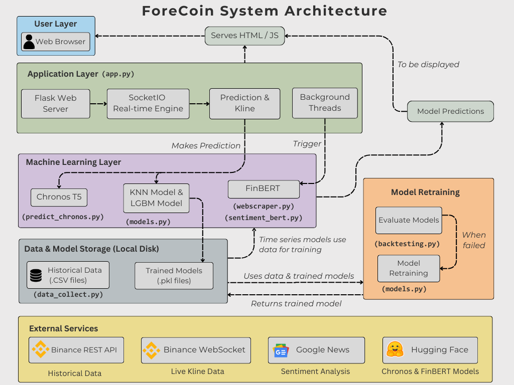

# ForeCoin

This is the implementation of project 4.2: Financial Advisor Bot.

This web application is a real-time cryptocurrency analysis tool that uses artificial intelligence to provide market insights in order to make recommendations for a dynamic investment strategy. 
______
<h3 align="center">About the Bot</h3>

The analysis tool uses artificial intelligence to provide market insights. It combines two primary AI models: a sentiment analysis model that scans live news to gauge market mood, and a time-series forecasting model (Chronos-T5) to predict future price movements. Navigate to the Dashboard for a market overview, or visit the "Stable" and "Volatile" coin pages for detailed, asset-specific predictions.


The bot currently works with 5 cryptocurrencies

**Stable Coins:** BTCUSDT, ETHUSDT, BNBUSDT

**Volatile Coins:** DOGEUSDT, SHIBUSDT
______
<h3 align="center">🖥️ Getting Started 🏃</h3>

When forking this repository, do downlad the following folders from [ForeCoin's Additional Folders](https://drive.google.com/drive/folders/1Kjud_lSsUpXyWbvnWEUV0b0rf-ev2BmF?usp=sharing)

As some files are relatively big, not all files are loaded into this github repository.

List of folders that can be downloaded:

- **historic_data** 
- **apps**
- **prediction_logs**
- **_pycache_**


Run the requirements.txt file 
- ```pip install -r requirements.txt```

then run the following 

- ```pip install --upgrade --force-reinstall "feedparser>=6.0.10"```

(As ```pygooglenews``` strictly requires ```feedparser``` to be less than version 6.0.0, we would need to forcibly upgrade it)

______

<h3 align="center">The Machine Learning Models</h3>

**KNN With Supertrend** 

We monitor major cryptocurrencies including Bitcoin (BTC), Ethereum (ETH), and Binance Coin (BNB). These stable assets are analyzed using specialized KNN Supertrend models optimized for less volatile market movements.

**LGBM with Quantile Regression** 

For high-volatility cryptocurrencies like Dogecoin (DOGE) and Shiba Inu (SHIB), we employ LGBM Quantile models that provide low, median, and high prediction ranges to account for their unpredictable price movements.

**Chronos T5** 

The Chronos-T5 time-series forecasting model analyzes historical price data to predict future cryptocurrency prices. Combined with traditional machine learning models like KNN and LGBM, we provide multiple prediction perspectives for enhanced accuracy.


**FinBERT for Sentiment Analysis** 

The sentiment analysis component scans cryptocurrency-related news articles and social media posts to determine the overall market sentiment. This helps identify potential market movements based on public opinion and news events.


______
<h3 align="center">🗃️System Architecture🗃️</h3>

*insert image of system architecture here*



*Explain briefly on the system architecture*


```
ForeCoin/
│
├── apps/
│   ├── static/
│   │   └── assets/
│   │        ├── package.json/
│   |        ├── css/
│   |        ├── img/
│   |        ├── vendor/
│   |        └── js/
│   |            ├── dashboard_updater.js
│   |            ├── index_search.js
│   |            ├── stable_updater.js
│   |            ├── volatile_updater.js
│   |            └── volt.js
|   |
│   └── templates/
│       └── home/
│           ├── index.html
│           ├── dashboard.html
│           ├── stable.html
│           └── volatile.html
│       └── includes/
│           ├── footer.html
│           ├── navigation.html
│           ├── scripts.html
│           └── sidebar.html
│       └── layouts/
│           ├── base-fullscreen.html
│           └── base.html
|
├── historic_data/
│   ├── sentiment (can remove)/
│   ├── stable/
│   ├── volatile/
│   └── *all_coins_chronos_pred.csv*
│
├── trained_models/
│   ├── BNBUSDT_knn_supertrend_model.pkl
│   ├── BTCUSDT_knn_supertrend_model.pkl
│   ├── ETHUSDT_knn_supertrend_model.pkl
│   ├── DOGEUSDT_lgbm_quantile_model.pkl
│   ├── SHIBUSDT_lgbm_quantile_model.pkl
│   └── *all_coins_chronos_pred.csv*
|
├── trained_models/
│   ├── backtest_log.json
│   ├── BNBUSDT_predictions.json
│   ├── BTCUSDT_predictions.json
│   ├── ETHUSDT_predictions.json
│   ├── SHIBUSDT_predictions.json
│   └── dogeUSDT_predictions.json
|
├── app.py
├── backtesting.py
├── data_collect.py
├── models.py
├── predict_chronos.py
├── sentiment_bert.py
├── webscraper.py
├── readme.md
└── requirements.txt
```
______
**Flask**
add words here

